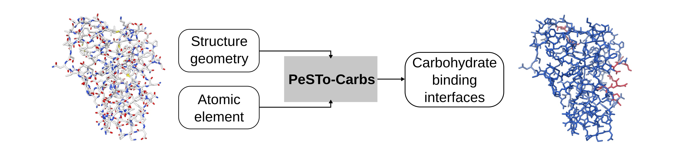

# PeSTo-Carbs: geometric deep learning for prediction of protein-carbohydrate binding interfaces


## Introduction
PeSTo-Carbs is an extension of [PeSTo](https://github.com/LBM-EPFL/PeSTo), trained to predict protein-carbohydrate and protein-cyclodextrin binding interfaces. We provide two models for PeSTo-Carbs: a general model PS-G (`ps-s.pt`) for a wide range of carbohydrates, their derivatives and cyclodextrins and a specific PS-S (`ps-s.pt`) trained on specific important carbohydrate monomers. The method is available on our webserver at [pesto.epfl.ch](https://pesto.epfl.ch/).    

## Installation
Clone this repo or download the source code. To install dependencies, run
```
pip install -r requirements.txt
```
## Binding site prediction
The `apply_model.py` can be used to make predictions on PDB files. In the file `model_path` can be modified to specify `ps-g.pt` or `ps-s.pt` and `data_path` can be set to file paths for PDB files. For each PDB, two files will be generated, `<pdbid>_i0.pdb` for protein-carbohydrate prediction and `<pdbid>_i1.pdb` for protein-cyclodextrin prediction. The predicted values are stored in the b-factor column. This can be visualized in PyMOL using:
```
spectrum b, blue_white_red, all, 0, 1
```
Or in ChimeraX using:
```
color bfactor palette "#2B59C3:#D1D1D1:#D7263D" range 0,1
```

## License

This work is licensed under a
[Creative Commons Attribution-NonCommercial-ShareAlike 4.0 International License][cc-by-nc-sa].

[![CC BY-NC-SA 4.0][cc-by-nc-sa-image]][cc-by-nc-sa]

[cc-by-nc-sa]: http://creativecommons.org/licenses/by-nc-sa/4.0/
[cc-by-nc-sa-image]: https://licensebuttons.net/l/by-nc-sa/4.0/88x31.png
[cc-by-nc-sa-shield]: https://img.shields.io/badge/License-CC%20BY--NC--SA%204.0-lightgrey.svg

## Reference
Bibekar, P., Krapp, L., Dal Peraro, M. PeSTo-Carbs: Geometric Deep Learning for Prediction of Protein−Carbohydrate Binding Interfaces. _J. Chem. Theory Comput._, 2024. [DOI: 10.1021/acs.jctc.3c01028](https://doi.org/10.1021/acs.jctc.3c01145).
